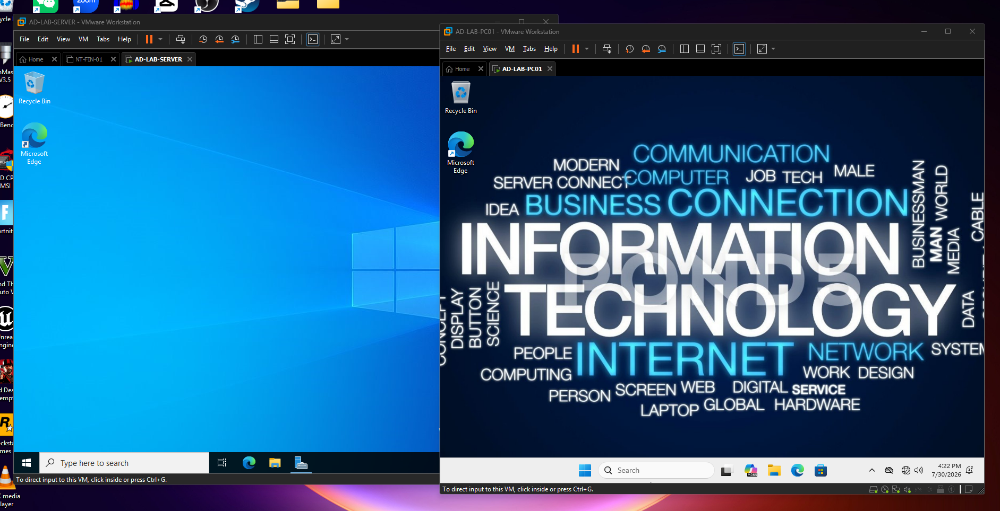
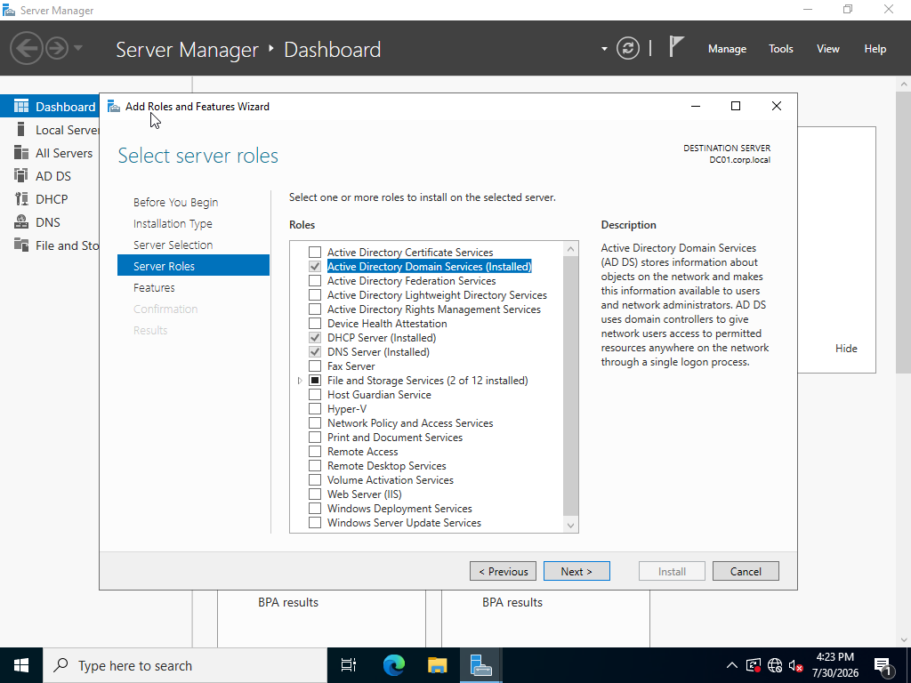
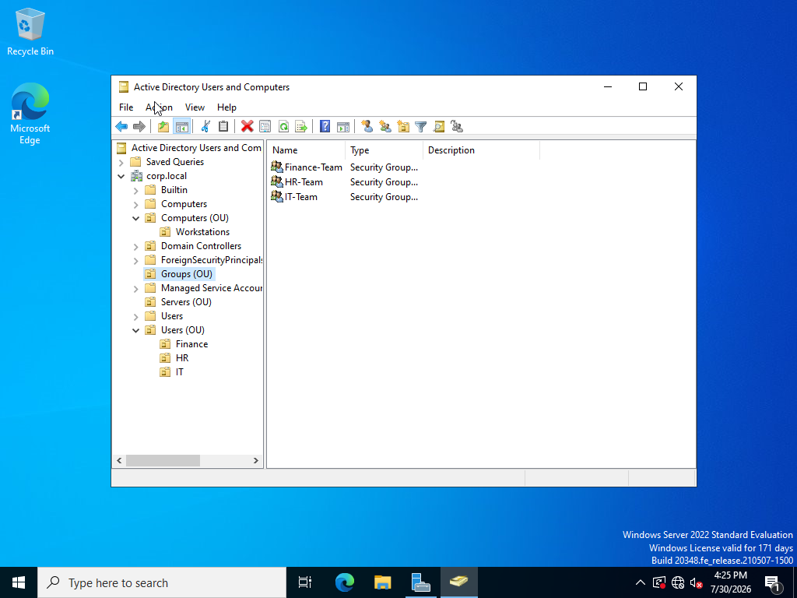
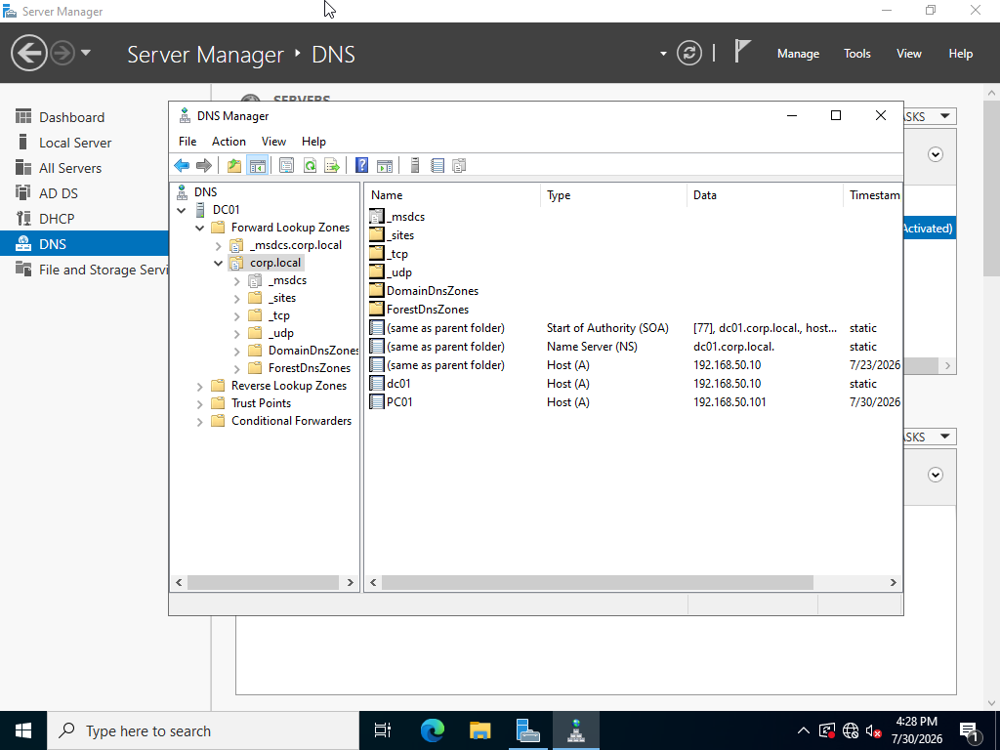
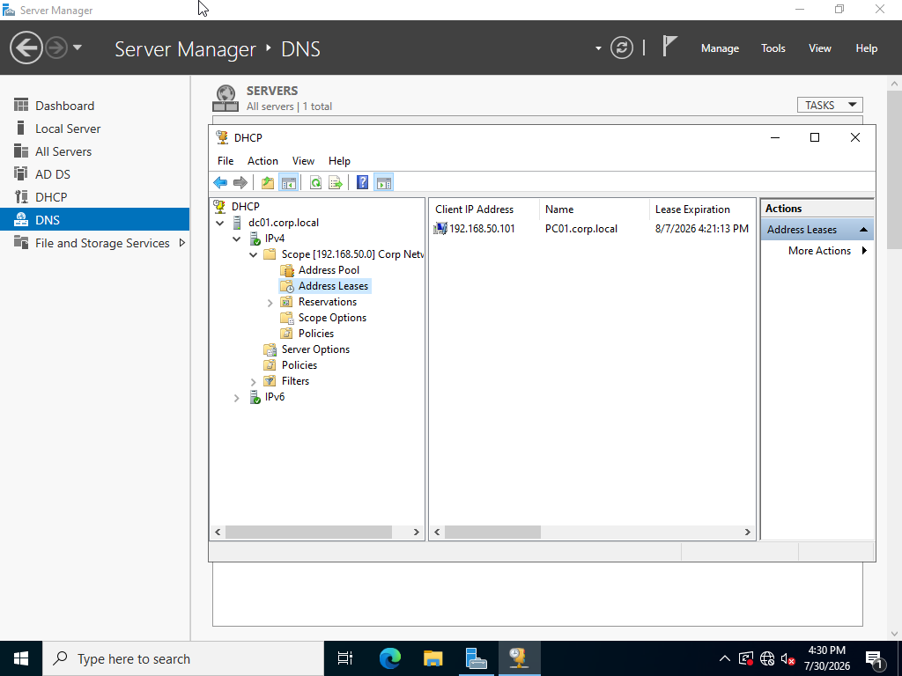
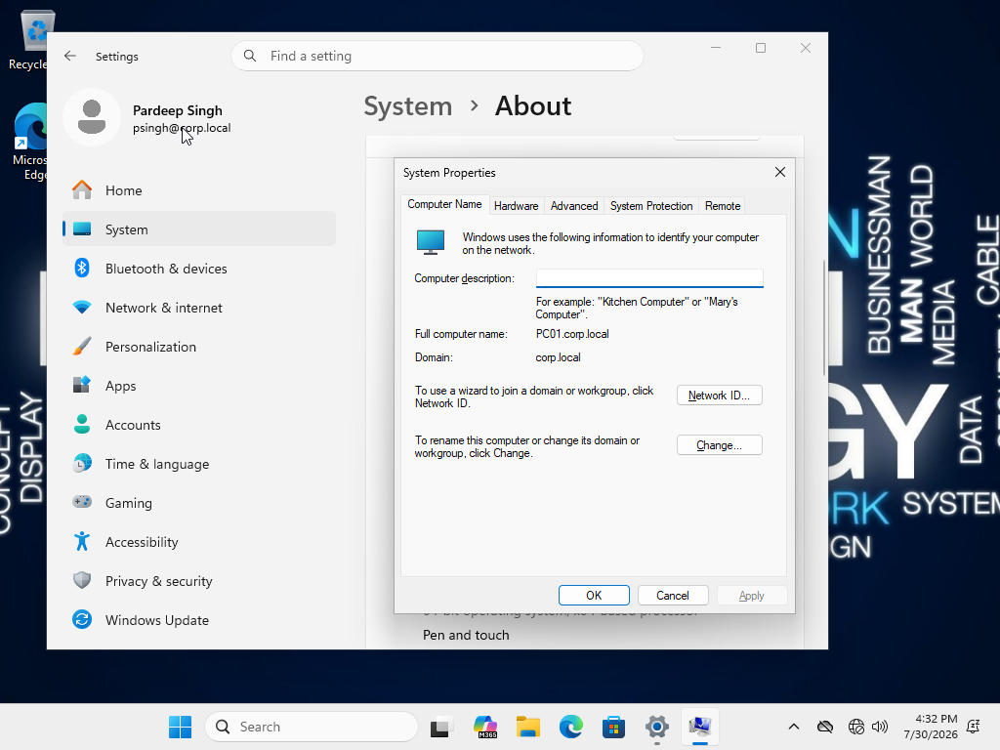
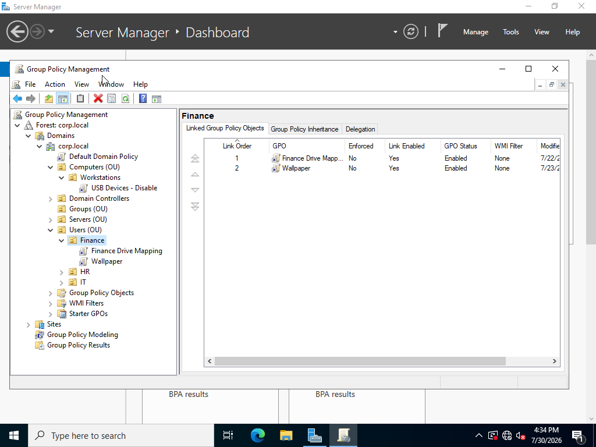
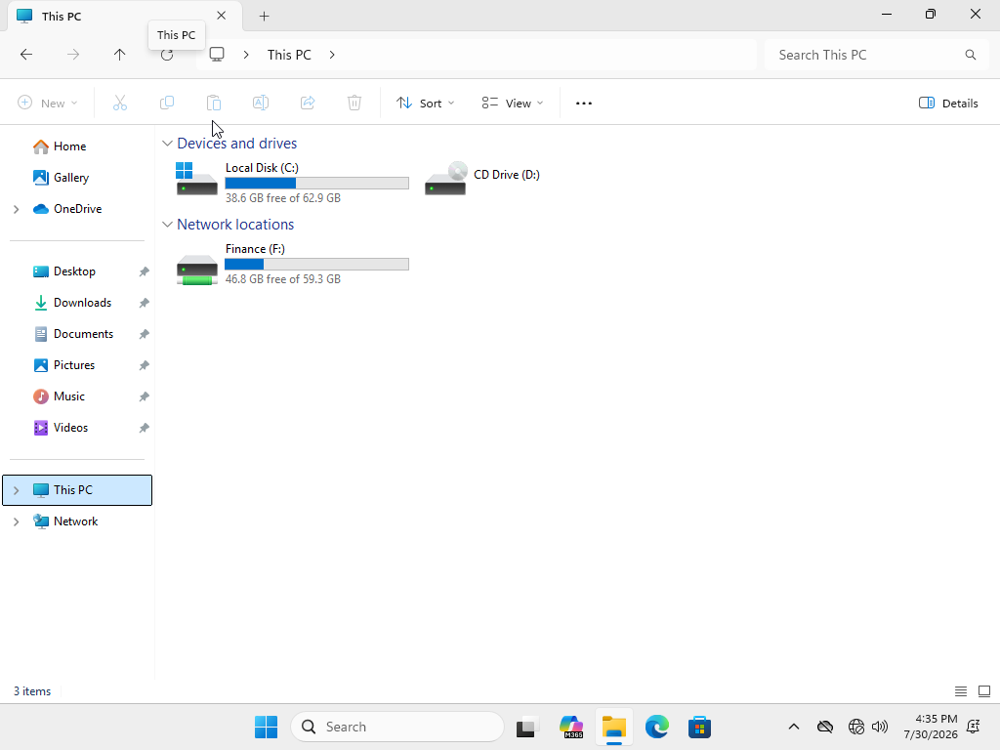
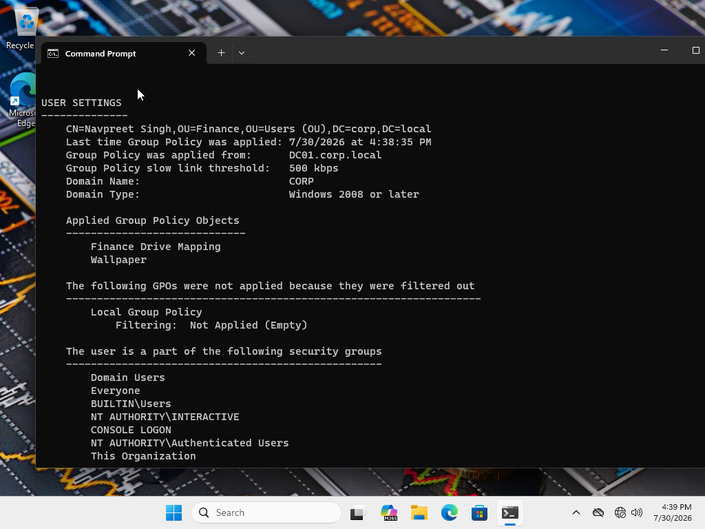

# Windows Server 2022 Active Directory Home Lab
Enterprise-style Active Directory lab using Windows Server 2022, Windows 11, and VMware Workstation Pro.

## Project Overview

This project demonstrates the design, deployment, and troubleshooting of a small enterprise-style Windows domain environment using Windows Server 2022, Windows 11, and VMware Workstation Pro.

The lab was built to practise common IT support and system administration tasks, including Active Directory administration, DNS, DHCP, Group Policy, shared folders, permissions, user onboarding, and troubleshooting domain-related issues.

## Lab Objectives

The main objectives of this project were to:

- Install and configure Windows Server 2022
- Promote the server to a Domain Controller
- Create and manage an Active Directory domain
- Configure DNS and DHCP services
- Join a Windows 11 client computer to the domain
- Create users, security groups, and organizational units
- Configure Group Policy Objects
- Deploy a mapped network drive
- Configure shared-folder permissions
- Troubleshoot authentication, DNS, DHCP, and Group Policy issues
- Document technical problems and their solutions

## Technologies Used

- Windows Server 2022
- Windows 11 Pro
- VMware Workstation Pro
- Active Directory Domain Services
- DNS
- DHCP
- Group Policy Management
- Windows File Sharing
- NTFS and share permissions
- Command Prompt and PowerShell
- Event Viewer
- Resource Monitor
- Performance Monitor

## Lab Environment

| System | Purpose | Configuration |
|---|---|---|
| DC01 | Domain Controller, DNS, and DHCP server | Windows Server 2022 |
| PC01 | Domain-joined client computer | Windows 11 Pro |
| Domain | Active Directory domain | `corp.local` |
| Network | VMware NAT network | `192.168.40.0/24` |
| Server IP | Static address assigned to DC01 | `192.168.40.10` |

## Network Design

The domain controller was configured with a static IP address to ensure that DNS, DHCP, and Active Directory services remained consistently available.

The Windows 11 client was configured to use DC01 as its DNS server so that it could locate the `corp.local` domain and communicate with Active Directory.

```text
Internet
   |
VMware NAT Network
   |
192.168.40.0/24
   |
   |-- DC01 - 192.168.40.10
   |     Windows Server 2022
   |     Active Directory
   |     DNS
   |     DHCP
   |
   |-- PC01
         Windows 11 Pro
         Domain-joined client
```

## Active Directory Configuration

The Active Directory domain was created as:

```text
corp.local
```

The Windows Server computer was renamed:

```text
DC01
```

The Windows 11 client computer was renamed:

```text
PC01
```

The following organizational structure was created:

```text
corp.local
|
|-- Users
|   |-- Finance
|   |-- HR
|   |-- IT
|
|-- Computers
    |-- Workstations
```

Example Active Directory objects created during the lab included:

- User account: John Smith
- Security group: Finance Team
- Department-based organizational units
- Workstations organizational unit

## User and Group Administration

The lab included the following user-management tasks:

- Creating domain user accounts
- Creating security groups
- Adding users to department groups
- Organizing users into departmental OUs
- Moving computers into the Workstations OU
- Testing domain-user sign-in
- Managing access through group membership

These tasks simulated basic employee onboarding and access-management responsibilities.

## DNS Configuration

DNS was installed with Active Directory Domain Services.

The DNS server was used to:

- Resolve the `corp.local` domain
- Locate the Domain Controller
- Resolve `dc01.corp.local`
- Support domain joining and authentication
- Allow the Windows 11 client to communicate with Active Directory

DNS resolution was tested using:

```cmd
nslookup dc01.corp.local
```

The successful result confirmed that the client could resolve the Domain Controller to:

```text
192.168.40.10
```

## DHCP Configuration

A DHCP scope was created for the lab network:

```text
192.168.40.0/24
```

The DHCP server was authorized in Active Directory.

The DHCP configuration included:

- IP address scope
- Subnet mask
- Default gateway
- DNS server option
- Domain name option
- Address leases
- Lease duration

The DNS option was configured to point domain clients to:

```text
192.168.40.10
```

## Windows 11 Domain Join

PC01 was joined to the following Active Directory domain:

```text
corp.local
```

After the domain join, sign-in was tested using a domain user account.

The successful sign-in confirmed that:

- PC01 could communicate with DC01
- DNS was resolving correctly
- Active Directory authentication was working
- The client computer was successfully joined to the domain

## Group Policy Configuration

Several Group Policy scenarios were tested during the project.

Examples included:

- Mapped network drive deployment
- Department-specific wallpaper
- Control Panel restrictions
- USB storage restrictions
- User-based and computer-based policy assignment

Policies were linked to the appropriate organizational units so that they applied only to the intended users or devices.

Group Policy results were verified using:

```cmd
gpupdate /force
```

and:

```cmd
gpresult /r
```

## Shared Folder and Drive Mapping

A Finance shared folder was created on DC01.

Access was assigned using the Finance security group.

A Group Policy Preference was used to map the shared folder as:

```text
F:
```

The mapped drive appeared automatically when the Finance user signed in to PC01.

A test file created from PC01 was successfully visible on DC01, confirming that:

- The network share was accessible
- Group Policy applied correctly
- User permissions were working
- File changes were visible across the network

## Troubleshooting Scenarios

### DNS Configuration Issue

One of the major issues encountered was incorrect DNS configuration on the client computer.

The client was initially unable to locate the domain because it was using an incorrect DNS server.

The issue was resolved by:

1. Configuring DC01 with a static IP address
2. Setting PC01 to use DC01 as its DNS server
3. Updating DHCP DNS options
4. Renewing the client network configuration
5. Testing DNS resolution with `nslookup`
6. Attempting the domain join again

### Domain Trust and Authentication Issue

During an earlier version of the lab, the client experienced a domain trust and authentication problem.

The troubleshooting process included:

- Verifying network connectivity
- Checking DNS settings
- Confirming the Domain Controller was reachable
- Verifying the computer account in Active Directory
- Rebuilding the lab after identifying configuration inconsistencies

The rebuilt environment successfully joined the domain and authenticated domain users.

### Group Policy Troubleshooting

When policies did not appear immediately, the following commands were used:

```cmd
gpupdate /force
```

```cmd
gpresult /r
```

Additional checks included:

- Confirming the GPO was linked to the correct OU
- Confirming the user or computer was inside the correct OU
- Checking security filtering
- Signing out and signing back in
- Restarting the client when necessary

## Skills Demonstrated

This project demonstrates practical experience with:

- Windows Server installation and configuration
- Active Directory Domain Services
- User and group administration
- Organizational Unit design
- Domain joining
- DNS troubleshooting
- DHCP configuration
- Group Policy administration
- File sharing and permissions
- Network drive mapping
- Windows troubleshooting
- Authentication troubleshooting
- Technical documentation
- IT support problem solving
- Basic enterprise infrastructure design

## Screenshots

### VMware Lab Environment



### Server Roles



### Active Directory Structure



### DNS Configuration



### DHCP Scope



### Domain-Joined Windows 11 Client



### Group Policy Management



### Finance Mapped Drive



### Group Policy Verification



## Key Takeaways

This project helped me understand how Active Directory, DNS, DHCP, Group Policy, file sharing, and Windows client devices work together in a domain environment.

The most important lesson was that Active Directory depends heavily on correct DNS configuration. A client may have network connectivity and internet access but still fail to join or authenticate with a domain if DNS is not configured correctly.

The project also strengthened my ability to troubleshoot problems systematically by verifying network configuration, DNS resolution, service status, Group Policy scope, permissions, and Windows event information.

## Future Improvements

Future improvements to this lab may include:

- Additional onboarding and offboarding scenarios
- Password and account-lockout policies
- Printer deployment
- Software deployment through Group Policy
- Windows Server Update Services
- File-server quotas
- Backup and restore testing
- Additional security policies
- PowerShell automation
- Hybrid Active Directory and Microsoft Entra ID integration

## Author

**Pardeep Singh**

CompTIA A+ Certified  
Computer Systems Technician - Software Support  
Mohawk College

LinkedIn: `linkedin.com/in/pardeep1s1`
